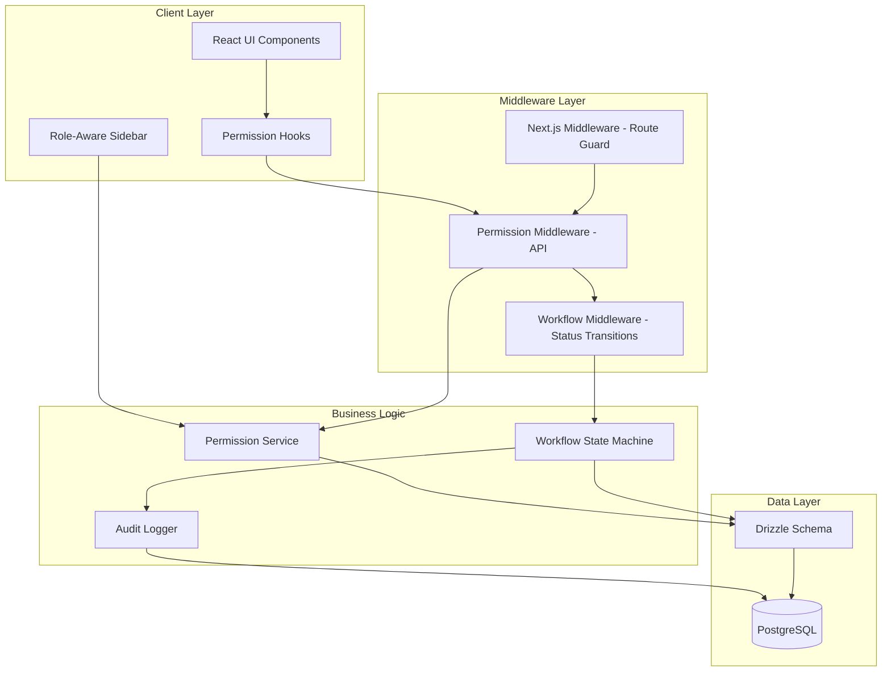
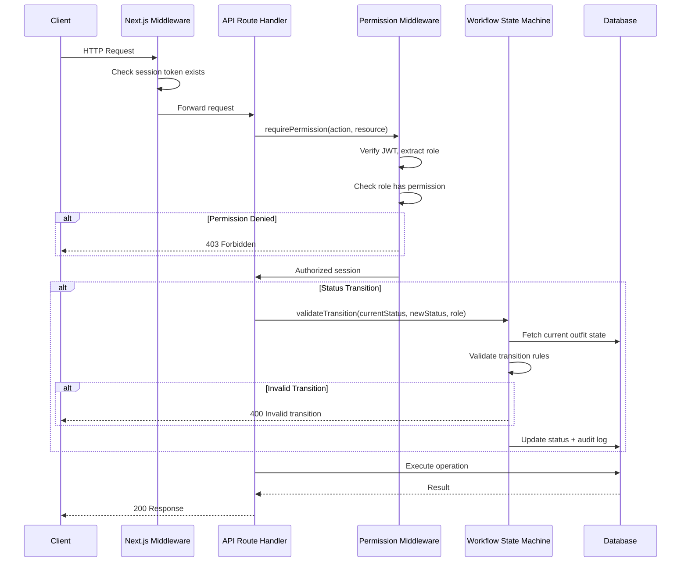
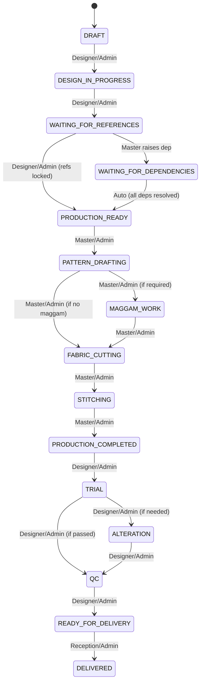

# Design Document: Role-Based Access Control & Production Workflow

## Overview

This feature implements a comprehensive V1 Role-Based Access Control (RBAC) system and production workflow enforcement for the Designer Studio Management application. The system enforces a strict responsibility matrix across five roles (Admin, Reception, Designer, Master, Customer) covering all API routes and UI components. Additionally, it enforces a linear production workflow state machine with role-gated transitions, ensuring outfits progress through the correct lifecycle stages with proper authorization checks.

The design integrates with the existing Next.js 15 App Router application using Drizzle ORM, JWT session cookies, and the established `requireAuth` pattern. It introduces a permission middleware layer, a workflow state machine, and role-aware sidebar navigation without requiring schema changes to existing tables.

## Architecture



## Sequence Diagrams

### API Request with Permission Check



### Production Workflow State Machine



## Components and Interfaces

### Component 1: Permission Service (`src/lib/permissions.ts`)

**Purpose**: Centralized permission checking. Maps roles to allowed actions on resources.

**Interface**:
```typescript
type Role = "ADMIN" | "RECEPTION" | "DESIGNER" | "MASTER" | "CUSTOMER";

type Resource = 
  | "customer" | "order" | "outfit" | "measurement"
  | "reference" | "material" | "production" | "dependency"
  | "payment" | "portal" | "user";

type Action = 
  | "create" | "read" | "update" | "delete"
  | "upload" | "select" | "lock" | "release"
  | "transition" | "view_progress";

interface Permission {
  resource: Resource;
  action: Action;
  condition?: (context: PermissionContext) => boolean;
}

interface PermissionContext {
  userId: string;
  role: Role;
  resourceOwnerId?: string;
  outfitStatus?: string;
  isAssigned?: boolean;
}

function hasPermission(role: Role, resource: Resource, action: Action, context?: PermissionContext): boolean;
function getPermissions(role: Role): Permission[];
function requirePermission(role: Role, resource: Resource, action: Action, context?: PermissionContext): void;
```

**Responsibilities**:
- Maintain the responsibility matrix as a declarative permission map
- Evaluate role-based access with optional contextual conditions
- Throw `ForbiddenError` when access is denied
- Support Admin override (full access to everything)

### Component 2: Workflow State Machine (`src/lib/workflow.ts`)

**Purpose**: Enforces valid production status transitions with role authorization and precondition checks.

**Interface**:
```typescript
type OutfitStatus =
  | "DRAFT" | "DESIGN_IN_PROGRESS" | "WAITING_FOR_REFERENCES"
  | "WAITING_FOR_DEPENDENCIES" | "PRODUCTION_READY"
  | "PATTERN_DRAFTING" | "MAGGAM_WORK" | "FABRIC_CUTTING"
  | "STITCHING" | "PRODUCTION_COMPLETED"
  | "TRIAL" | "ALTERATION" | "QC"
  | "READY_FOR_DELIVERY" | "DELIVERED";

interface TransitionRule {
  from: OutfitStatus;
  to: OutfitStatus;
  allowedRoles: Role[];
  preconditions?: TransitionPrecondition[];
}

type TransitionPrecondition =
  | { type: "references_locked"; referenceType?: "PATTERN" | "MAGGAM" }
  | { type: "no_pending_dependencies" }
  | { type: "maggam_required" }
  | { type: "maggam_not_required" }
  | { type: "assigned_master"; masterId: string };

interface TransitionResult {
  success: boolean;
  error?: string;
  newStatus?: OutfitStatus;
}

function validateTransition(
  outfitId: string,
  fromStatus: OutfitStatus,
  toStatus: OutfitStatus,
  role: Role,
  context?: { userId: string }
): Promise<TransitionResult>;

function getAvailableTransitions(
  outfitId: string,
  currentStatus: OutfitStatus,
  role: Role
): Promise<OutfitStatus[]>;
```

**Responsibilities**:
- Define the complete transition graph with allowed roles per edge
- Validate preconditions before allowing transitions (e.g., refs must be locked)
- Return available next states for UI rendering
- Log all transitions to productionLogs table

### Component 3: Permission Middleware (`src/lib/api-guard.ts`)

**Purpose**: Wrapper for API route handlers that combines auth + permission checks.

**Interface**:
```typescript
interface RouteConfig {
  resource: Resource;
  action: Action;
  allowedRoles?: Role[];
}

type AuthenticatedHandler = (
  request: Request,
  context: { params: Promise<Record<string, string>>; session: SessionUser }
) => Promise<Response>;

function withPermission(config: RouteConfig, handler: AuthenticatedHandler): (request: Request, context: any) => Promise<Response>;
```

**Responsibilities**:
- Extract and verify JWT session
- Check role-based permissions via Permission Service
- Pass authenticated session to handler
- Return standardized error responses (401, 403)

### Component 4: Role-Aware Sidebar (`src/components/sidebar.tsx`)

**Purpose**: Renders navigation items based on the authenticated user's role.

**Interface**:
```typescript
interface NavItem {
  label: string;
  href: string;
  icon: React.ReactNode;
  badge?: number;
}

interface SidebarConfig {
  [role: string]: NavItem[];
}
```

**Responsibilities**:
- Map each role to its permitted navigation items
- Highlight active route
- Show production card count badge for Master role
- Support mobile responsive toggle

### Component 5: Client Permission Hook (`src/hooks/use-permissions.ts`)

**Purpose**: Provides client-side permission checks for conditional UI rendering.

**Interface**:
```typescript
function usePermissions(): {
  can: (action: Action, resource: Resource) => boolean;
  role: Role;
  isAdmin: boolean;
};
```

**Responsibilities**:
- Read role from session context
- Expose `can()` helper for conditional rendering
- Prevent UI elements from showing for unauthorized roles

## Data Models

### Permission Map (Static Configuration)

```typescript
// No new database tables needed — permissions are defined as code

const PERMISSION_MATRIX: Record<Role, Record<Resource, Action[]>> = {
  ADMIN: {
    customer: ["create", "read", "update", "delete"],
    order: ["create", "read", "update", "delete"],
    outfit: ["create", "read", "update", "delete"],
    measurement: ["create", "read", "update"],
    reference: ["create", "read", "update", "upload", "select", "lock"],
    material: ["create", "read", "update"],
    production: ["read", "view_progress"],
    dependency: ["read", "view_progress"],
    payment: ["create", "read"],
    portal: ["create", "read"],
    user: ["create", "read", "update", "delete"],
  },
  RECEPTION: {
    customer: ["create", "read", "update"],
    order: ["create", "read", "update"],
    outfit: ["create", "read"],
    measurement: [],
    reference: ["read"],
    material: [],
    production: ["read", "view_progress"],
    dependency: [],
    payment: ["create", "read"],
    portal: ["create"],
    user: [],
  },
  DESIGNER: {
    customer: ["read"],
    order: ["read"],
    outfit: ["create", "read", "update"],
    measurement: ["create", "read", "update"],
    reference: ["create", "read", "update", "upload", "select", "lock"],
    material: ["create", "read", "update"],
    production: ["read", "view_progress"],
    dependency: ["read"],
    payment: [],
    portal: [],
    user: [],
  },
  MASTER: {
    customer: [],
    order: [],
    outfit: ["read", "update"],
    measurement: ["read"],
    reference: ["read"],
    material: [],
    production: ["read", "update", "transition"],
    dependency: ["create", "read"],
    payment: [],
    portal: [],
    user: [],
  },
  CUSTOMER: {
    customer: [],
    order: ["read"],
    outfit: ["read"],
    measurement: [],
    reference: ["read", "upload"],
    material: [],
    production: ["view_progress"],
    dependency: [],
    payment: ["read"],
    portal: ["read"],
    user: [],
  },
};
```

### Workflow Transition Rules (Static Configuration)

```typescript
const TRANSITION_RULES: TransitionRule[] = [
  // Design phase
  { from: "DRAFT", to: "DESIGN_IN_PROGRESS", allowedRoles: ["ADMIN", "DESIGNER"] },
  { from: "DESIGN_IN_PROGRESS", to: "WAITING_FOR_REFERENCES", allowedRoles: ["ADMIN", "DESIGNER"] },
  
  // Release to production
  { from: "WAITING_FOR_REFERENCES", to: "PRODUCTION_READY",
    allowedRoles: ["ADMIN", "DESIGNER"],
    preconditions: [{ type: "references_locked" }]
  },
  
  // Dependency handling
  { from: "WAITING_FOR_REFERENCES", to: "WAITING_FOR_DEPENDENCIES", allowedRoles: ["ADMIN", "MASTER"] },
  { from: "WAITING_FOR_DEPENDENCIES", to: "PRODUCTION_READY",
    allowedRoles: ["ADMIN", "DESIGNER"],
    preconditions: [{ type: "no_pending_dependencies" }]
  },
  
  // Production phase
  { from: "PRODUCTION_READY", to: "PATTERN_DRAFTING", allowedRoles: ["ADMIN", "MASTER"] },
  { from: "PATTERN_DRAFTING", to: "MAGGAM_WORK",
    allowedRoles: ["ADMIN", "MASTER"],
    preconditions: [{ type: "maggam_required" }]
  },
  { from: "PATTERN_DRAFTING", to: "FABRIC_CUTTING",
    allowedRoles: ["ADMIN", "MASTER"],
    preconditions: [{ type: "maggam_not_required" }]
  },
  { from: "MAGGAM_WORK", to: "FABRIC_CUTTING", allowedRoles: ["ADMIN", "MASTER"] },
  { from: "FABRIC_CUTTING", to: "STITCHING", allowedRoles: ["ADMIN", "MASTER"] },
  { from: "STITCHING", to: "PRODUCTION_COMPLETED", allowedRoles: ["ADMIN", "MASTER"] },
  
  // Post-production phase
  { from: "PRODUCTION_COMPLETED", to: "TRIAL", allowedRoles: ["ADMIN", "DESIGNER"] },
  { from: "TRIAL", to: "ALTERATION", allowedRoles: ["ADMIN", "DESIGNER"] },
  { from: "TRIAL", to: "QC", allowedRoles: ["ADMIN", "DESIGNER"] },
  { from: "ALTERATION", to: "QC", allowedRoles: ["ADMIN", "DESIGNER"] },
  { from: "QC", to: "READY_FOR_DELIVERY", allowedRoles: ["ADMIN", "DESIGNER"] },
  
  // Delivery
  { from: "READY_FOR_DELIVERY", to: "DELIVERED", allowedRoles: ["ADMIN", "RECEPTION"] },
];
```

### Master Assignment Constraint

```typescript
// Masters can only view/update outfits assigned to them
interface MasterAccessRule {
  condition: (outfit: Outfit, session: SessionUser) => boolean;
  rule: "Masters can only access outfits where outfit.masterId === session.id";
}
```

## Algorithmic Pseudocode

### Permission Check Algorithm

```typescript
function hasPermission(
  role: Role,
  resource: Resource,
  action: Action,
  context?: PermissionContext
): boolean {
  // Admin has full access
  if (role === "ADMIN") return true;

  // Lookup permissions in matrix
  const allowedActions = PERMISSION_MATRIX[role]?.[resource] ?? [];
  if (!allowedActions.includes(action)) return false;

  // Apply contextual constraints
  if (role === "MASTER" && resource === "production") {
    // Master can only access assigned outfits
    if (context && !context.isAssigned) return false;
  }

  if (role === "MASTER" && resource === "reference" && action === "read") {
    // Master can only see LOCKED references
    // (enforced at query level, not here)
    return true;
  }

  return true;
}
```

**Preconditions:**
- `role` is a valid Role enum value
- `resource` is a valid Resource enum value
- `action` is a valid Action enum value

**Postconditions:**
- Returns `true` if and only if the role is authorized for the action on the resource
- Admin always returns `true`
- Master context constraint is enforced when `context.isAssigned` is provided

### Workflow Transition Validation Algorithm

```typescript
async function validateTransition(
  outfitId: string,
  fromStatus: OutfitStatus,
  toStatus: OutfitStatus,
  role: Role,
  context?: { userId: string }
): Promise<TransitionResult> {
  // Step 1: Find matching transition rule
  const rule = TRANSITION_RULES.find(
    r => r.from === fromStatus && r.to === toStatus
  );
  
  if (!rule) {
    return { success: false, error: `Invalid transition: ${fromStatus} → ${toStatus}` };
  }

  // Step 2: Check role authorization
  if (!rule.allowedRoles.includes(role)) {
    return { success: false, error: `Role ${role} cannot perform this transition` };
  }

  // Step 3: Evaluate preconditions
  if (rule.preconditions) {
    for (const precondition of rule.preconditions) {
      const satisfied = await evaluatePrecondition(outfitId, precondition);
      if (!satisfied) {
        return { success: false, error: `Precondition not met: ${precondition.type}` };
      }
    }
  }

  // Step 4: For Master, verify assignment
  if (role === "MASTER") {
    const outfit = await getOutfit(outfitId);
    if (outfit.masterId !== context?.userId) {
      return { success: false, error: "Master not assigned to this outfit" };
    }
  }

  return { success: true, newStatus: toStatus };
}
```

**Preconditions:**
- `outfitId` exists in database
- `fromStatus` matches current outfit status in DB
- `role` is authenticated user's role

**Postconditions:**
- Returns `success: true` only if transition is valid, role is authorized, and all preconditions pass
- Returns descriptive error message on failure
- Does NOT modify database state (caller handles persistence)

**Loop Invariants:**
- For precondition evaluation loop: all previously checked preconditions were satisfied

### Precondition Evaluation Algorithm

```typescript
async function evaluatePrecondition(
  outfitId: string,
  precondition: TransitionPrecondition
): Promise<boolean> {
  switch (precondition.type) {
    case "references_locked": {
      const refs = await db.select().from(referenceImages)
        .where(eq(referenceImages.outfitId, outfitId));
      const patternRefs = refs.filter(r => r.type === "PATTERN");
      // At least one pattern ref must exist and all must be locked
      if (patternRefs.length === 0) return false;
      return patternRefs.every(r => r.status === "LOCKED");
    }
    
    case "no_pending_dependencies": {
      const deps = await db.select().from(dependencies)
        .where(and(
          eq(dependencies.outfitId, outfitId),
          ne(dependencies.status, "AVAILABLE")
        ));
      return deps.length === 0;
    }
    
    case "maggam_required": {
      const [outfit] = await db.select().from(outfits)
        .where(eq(outfits.id, outfitId));
      return outfit.maggamRequired === true;
    }
    
    case "maggam_not_required": {
      const [outfit] = await db.select().from(outfits)
        .where(eq(outfits.id, outfitId));
      return outfit.maggamRequired === false;
    }

    default:
      return false;
  }
}
```

**Preconditions:**
- `outfitId` references a valid outfit record
- Database connection is available

**Postconditions:**
- Returns `true` if and only if the specific precondition is satisfied
- `references_locked`: true when at least one PATTERN reference exists AND all PATTERN references have LOCKED status
- `no_pending_dependencies`: true when zero dependencies have status != AVAILABLE
- `maggam_required/not_required`: true based on outfit.maggamRequired field

## Key Functions with Formal Specifications

### Function: `withPermission()` — API Route Guard

```typescript
function withPermission(
  config: RouteConfig,
  handler: AuthenticatedHandler
): (request: Request, context: any) => Promise<Response>
```

**Preconditions:**
- `config.resource` is a valid Resource
- `config.action` is a valid Action
- `handler` is an async function that returns a Response

**Postconditions:**
- Returns 401 if no valid session token
- Returns 403 if role lacks permission for resource+action
- Calls handler with authenticated session if permission check passes
- Never calls handler if auth/permission fails

### Function: `getAvailableTransitions()` — UI State Query

```typescript
async function getAvailableTransitions(
  outfitId: string,
  currentStatus: OutfitStatus,
  role: Role
): Promise<OutfitStatus[]>
```

**Preconditions:**
- `outfitId` exists in database
- `currentStatus` matches outfit's actual current status
- `role` is the requesting user's role

**Postconditions:**
- Returns array of valid next statuses the user can trigger
- Empty array if no transitions available for this role
- Each returned status has a valid TransitionRule from currentStatus
- For Master role: only returns transitions for assigned outfits

### Function: `filterByAssignment()` — Master Data Scoping

```typescript
async function filterByAssignment(
  session: SessionUser,
  query: SelectQueryBuilder
): Promise<SelectQueryBuilder>
```

**Preconditions:**
- `session` is a valid authenticated session
- `query` is a Drizzle select query on outfits table

**Postconditions:**
- If role is MASTER: adds WHERE clause `outfit.masterId = session.id`
- If role is not MASTER: returns query unchanged
- Never expands query scope beyond original intent

## Example Usage

### Using Permission Guard in API Routes

```typescript
// src/app/api/customers/route.ts
import { withPermission } from "@/lib/api-guard";

export const POST = withPermission(
  { resource: "customer", action: "create" },
  async (request, { session }) => {
    const body = await request.json();
    const [customer] = await db.insert(customers).values(body).returning();
    return NextResponse.json(customer, { status: 201 });
  }
);

export const GET = withPermission(
  { resource: "customer", action: "read" },
  async (request, { session }) => {
    const allCustomers = await db.select().from(customers);
    return NextResponse.json(allCustomers);
  }
);
```

### Using Workflow Transition in API Routes

```typescript
// src/app/api/outfits/[id]/transition/route.ts
import { withPermission } from "@/lib/api-guard";
import { validateTransition, executeTransition } from "@/lib/workflow";

export const POST = withPermission(
  { resource: "production", action: "transition" },
  async (request, { params, session }) => {
    const { id } = await params;
    const { newStatus } = await request.json();
    
    const [outfit] = await db.select().from(outfits).where(eq(outfits.id, id));
    
    const result = await validateTransition(
      id, outfit.status, newStatus, session.role, { userId: session.id }
    );
    
    if (!result.success) {
      return NextResponse.json({ error: result.error }, { status: 400 });
    }
    
    await executeTransition(id, newStatus, session);
    return NextResponse.json({ status: newStatus });
  }
);
```

### Client-Side Permission Check

```typescript
// In a React component
import { usePermissions } from "@/hooks/use-permissions";

function OutfitActions({ outfit }: { outfit: Outfit }) {
  const { can } = usePermissions();
  
  return (
    <div>
      {can("update", "measurement") && (
        <Button onClick={() => openMeasurements(outfit.id)}>
          Edit Measurements
        </Button>
      )}
      {can("lock", "reference") && (
        <Button onClick={() => lockReferences(outfit.id)}>
          Lock References
        </Button>
      )}
      {can("transition", "production") && (
        <StatusTransitionMenu outfit={outfit} />
      )}
    </div>
  );
}
```

## Correctness Properties

### Property 1: Admin role always has access
∀ request, role: For any API request made by an Admin user, permission check returns true regardless of resource or action.

### Property 2: Only valid transitions are allowed
∀ outfit, transition: For any outfit status change, there must exist a matching TransitionRule in TRANSITION_RULES where `rule.from === currentStatus && rule.to === newStatus`.

### Property 3: Only authorized roles can trigger transitions
∀ outfit, transition, role: For any status transition, the triggering user's role must be in `rule.allowedRoles` for the matching TransitionRule.

### Property 4: References must be locked before production release
∀ outfit → PRODUCTION_READY: An outfit can only transition to PRODUCTION_READY if all PATTERN-type references have status LOCKED and at least one PATTERN reference exists.

### Property 5: Masters only see assigned outfits
∀ master, outfit: For any query by a Master-role user, results are filtered to only include outfits where `outfit.masterId === session.id`.

### Property 6: Masters only see locked references
∀ master, reference: When a Master queries reference images, only references with status LOCKED are returned.

### Property 7: Maggam routing is deterministic
∀ outfit, PATTERN_DRAFTING → next: If `outfit.maggamRequired === true` the only valid next state is MAGGAM_WORK; if false, the only valid next state is FABRIC_CUTTING.

### Property 8: Every transition is audit logged
∀ transition: For every successful status transition, a corresponding record is inserted into productionLogs with the outfit ID, new status, user ID, and timestamp.

### Property 9: Navigation items match permissions
∀ role, sidebar: For each role, every sidebar navigation item links to a resource the role has at least "read" permission for.

### Property 10: No internal data exposure via customer portal
∀ customer_portal: Customer portal queries never return designerNotes, specialInstructions, staff names, or dependency details.

## Error Handling

### Error Scenario 1: Unauthorized Access

**Condition**: User attempts an action their role doesn't permit
**Response**: HTTP 403 with `{ error: "You do not have permission to perform this action" }`
**Recovery**: Client hides the UI element; no retry needed

### Error Scenario 2: Invalid Workflow Transition

**Condition**: User attempts a status transition not in the transition graph
**Response**: HTTP 400 with `{ error: "Invalid transition: {from} → {to}", availableTransitions: [...] }`
**Recovery**: Client shows available transitions; user selects a valid one

### Error Scenario 3: Precondition Not Met

**Condition**: Transition exists but preconditions fail (e.g., refs not locked)
**Response**: HTTP 400 with `{ error: "Cannot proceed: references must be locked before releasing to production" }`
**Recovery**: Client shows what needs to be done (e.g., "Lock references first")

### Error Scenario 4: Master Accessing Unassigned Outfit

**Condition**: Master attempts to access/modify an outfit not assigned to them
**Response**: HTTP 403 with `{ error: "You are not assigned to this outfit" }`
**Recovery**: Master redirects to their production cards list

### Error Scenario 5: Concurrent Status Update

**Condition**: Two users attempt to transition the same outfit simultaneously
**Response**: Second request gets HTTP 409 with `{ error: "Outfit status has changed", currentStatus: "..." }`
**Recovery**: Client refreshes outfit state and shows updated options

## Testing Strategy

### Unit Testing Approach

- Test `hasPermission()` for every role × resource × action combination
- Test `validateTransition()` for every valid and invalid transition pair
- Test precondition evaluation for each precondition type
- Test `filterByAssignment()` for Master vs non-Master roles
- Coverage goal: 100% of permission matrix entries, 100% of transition rules

### Property-Based Testing Approach

**Property Test Library**: fast-check

Key properties to verify:
- Admin always has access (∀ resource, action: hasPermission("ADMIN", resource, action) === true)
- No role can skip workflow steps (∀ status, nextStatus: if no rule exists, transition fails)
- Transition determinism: for any given (from, to, role), result is always the same given same DB state
- Permission monotonicity: Admin permissions are a superset of all other roles

### Integration Testing Approach

- Test full API request cycle with JWT tokens for each role
- Test workflow progression from DRAFT to DELIVERED with proper role switching
- Test Master assignment filtering with multiple masters and outfits
- Test customer portal access with locked vs unlocked references
- Test concurrent access scenarios with optimistic locking

## Performance Considerations

- Permission checks are in-memory lookups (O(1) after initial map construction) — no DB queries needed
- Workflow validation requires at most 2 DB queries (outfit + precondition check)
- Master assignment filtering adds a single WHERE clause to existing queries
- Sidebar navigation is computed once at layout render, not per-page
- Consider caching `getAvailableTransitions()` result client-side with React Query stale time

## Security Considerations

- All permission checks happen server-side in API route handlers — client-side checks are UX-only
- JWT tokens contain role at time of issuance; role changes require re-login or token refresh
- Portal tokens are separate from staff JWT tokens; they provide scoped read-only access
- Master assignment constraint prevents horizontal privilege escalation between masters
- Audit log captures all state transitions for compliance and debugging
- Input validation (Zod) runs before permission checks to prevent injection

## Dependencies

- No new npm packages required
- Leverages existing: `jose` (JWT), `drizzle-orm` (queries), `zod` (validation)
- All permission/workflow logic is pure TypeScript — no external authorization services
- Existing `requireAuth()` function is extended, not replaced
